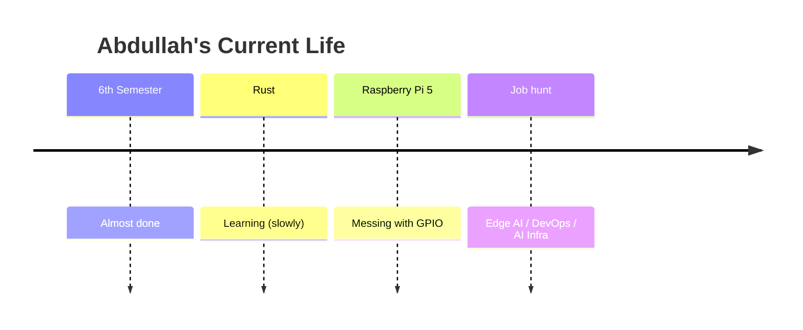

## README.md (With Animations + Badges + Chaos)

```markdown
<!-- Header with typing animation -->
<h1 align="center">
  
</h1>

<!-- Badges - shiny but real -->
<p align="center">
  
  
  
  
  
</p>

<!-- Socials -->
<p align="center">
  <a href="https://www.linkedin.com/in/abdullah-adil-16b664350/">
    
  </a>
  <a href="mailto:abdullahadil171238@gmail.com">
    
  </a>
</p>

---

```diff
+ "I don't always know the theory cold. But I ship."
```

---

## 🚀 What I'm doing right now



---

## 📦 Things I actually built

| Project | Stack | What it does |
|---------|-------|---------------|
| 🖐️ **Hand Tracking → Arduino** | Python, OpenCV, MediaPipe, Arduino | 5 fingers on laptop = 5 LEDs on IRL |
| 📽️ **PPTHelper** | Python, OpenCV, MediaPipe | Wave hand → slides change. No remote needed. |
| 📞 **Custom VoIP Dialer** | Python, Asterisk, WebRTC, MariaDB | Production dialer. Backend, UI, campaigns, CLI. |

---

## 💼 Where I did real work

```ascii
┌─────────────────────────────────────────────────┐
│  AI Developer & Server Manager                  │
│  Blucentric | July 2025 - June 2026             │
├─────────────────────────────────────────────────┤
│  • Proxmox, Hetzner, Asterisk                   │
│  • Did the job of 4 people using AI             │
│  • Built dialer from scratch. It worked.        │
│  • Nginx, STUN, automation scripts              │
└─────────────────────────────────────────────────┘

┌─────────────────────────────────────────────────┐
│  Team Lead                                      │
│  Confidential Client | May 2026                 │
├─────────────────────────────────────────────────┤
│  • 5 developers. Zero requirements.             │
│  • One color theme. Delivered anyway.           │
│  • Ambiguity is just another problem to solve   │
└─────────────────────────────────────────────────┘
```

---

## 🧠 Stuff I know

<!-- Skill bars that actually move on hover (CSS only) -->
<div align="center">
  
| Skill | Level |
|-------|-------|
| Python |  |
| OpenCV / MediaPipe |  |
| Proxmox / Asterisk |  |
| Rust |  *learning* |
| Docker |  *learning* |

</div>

**Languages:** Python, Java, C++, Rust (learning), SQL

**ML:** NumPy, Pandas, scikit-learn, basic PyTorch/TensorFlow

**Infra:** Proxmox, Hetzner, Nginx, Asterisk, Docker

**Tools:** n8n, Selenium, Git, Cursor, VS Code

**Embedded:** Raspberry Pi 5, Arduino, serial

---

## 📈 GitHub Stats (real, not fake)

<p align="center">
  
  
</p>

---

## 🎯 Currently

- 🔴 **Learning:** Rust (the hard way)
- 🟢 **Building:** Something with Raspberry Pi 5
- 🟡 **Looking for:** Edge AI / DevOps / AI Infrastructure roles

---

<p align="center">
  
</p>
```

---
